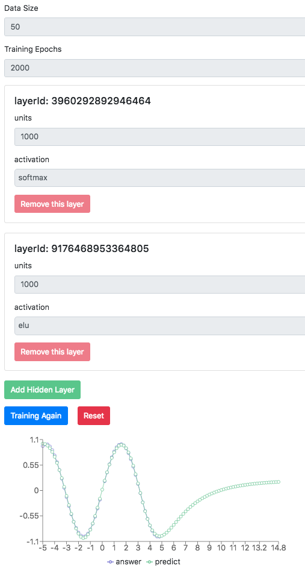

# tensorflow_js_playground

tensorflow js (tfjs) playground, you can add layers to training model to predict Math.sin line data.

```shell
git clone https://github.com/chnbohwr/tensorflow_js_playground
cd tensorflow_js_playground
yarn
yarn start
```
then open the browser http://localhost:1234

change code and it will hot reload. enjoy it.


